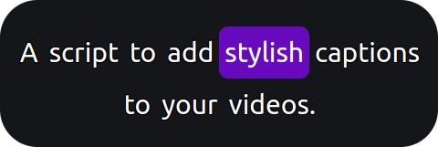

# PupCaps!

<p align="center">
    
</p>

**PupCaps!** is a Node.js script that makes it easy to add captions to your videos with fully customizable styles. 
Design your captions using CSS, allowing complete control over fonts, colors, positioning, and more.

###### Limitations
CSS3 animations are not currently supported.

<p align="center">
    
</p>

## Requirements

You need `node` and `ffmpeg` to be installed on your computer.

## Install

From npm:

```shell
npm i -g pupcaps@latest
```

of from sources:

```shell
git clone git@github.com:hosuaby/PupCaps.git
cd PupCaps
npm install
npm i -g .
```

## Usage

To use the script, you need a **SubRip Subtitle (.srt)** file. PupCaps enables you to create **Karaoke-style captioning** 
(also known as "word-by-word highlighting").

To achieve this effect, wrap the words you want to highlight in square brackets. For example:

```text
1
00:00:00.000 --> 00:00:00.500
A script to caption videos with style.

2
00:00:00.500 --> 00:00:01.000
[A] script to caption videos with style.

3
00:00:01.000 --> 00:00:01.500
A [script] to caption videos with style.

4
00:00:01.500 --> 00:00:02.000
A script [to] caption videos with style.
```

### Generate Overlay File

Run the PupCaps script to transform your `.srt` file into an **Apple QuickTime (MOV)** file. 
This MOV file will serve as a captions overlay for your video.

```shell
pupcaps path/to/subtitles.srt
```

This command will produce `.mov` in the same folder with subtitles (unless you provided `--output` option). 
Check section "Caption video" to learn how to use this file as overlay.

###### Output File

The resulting `.mov` file will be saved in the same folder as the input `.srt` file unless you specify a different 
output path using the `--output` option. Example:

```shell
pupcaps path/to/subtitles.srt --output path/to/output.mov
```

To learn how to overlay the generated `.mov` file on your video, see the section: "Caption Video."

### Style Captions

The appearance of captions can be fully customized using **CSS**. To do this, copy the contents of the file
[assets/captions.css](./assets/captions.css) and modify it to suit your preferences.

CSS allows you to define styles at various levels:

- The container (captions as a whole).
- Each phrase.
- Individual words.
- Highlighted words for dynamic effects.

Once you've customized your `.css` file, provide it to the PupCaps script using the `--style` option:

```shell
pupcaps path/to/subtitles.srt --style path/to/custom/styles.css
```

### Options

**Usage:** `pupcaps [options] <file>`

###### Arguments

| Argument | Description                                    |
|----------|------------------------------------------------|
| file     | Path to the input SubRip Subtitle (.srt) file. |

###### Options

| Option       | Default | Description                                                                                                                                                                |
|--------------|---------|----------------------------------------------------------------------------------------------------------------------------------------------------------------------------|
| -o, --output |         | Full or relative path where the created Films Apple QuickTime (MOV) file should be written. By default, it will be saved in the same directory as the input subtitle file. |
| -w, --width  | 1080    | Width of the video in pixels.                                                                                                                                              |
| -h, --height | 1920    | Height of the video in pixels.                                                                                                                                             |
| -s, --style  |         | Full or relative path to the styles .css file. If not provided, default styles for captions will be used.                                                                  |

## Caption Video

To add captions to your video, use **FFmpeg** with the `filter_complex:overlay` filter. 
Below is an example command. You can adjust the codecs and parameters to suit your needs:

```shell
ffmpeg \
  -i original-video.mp4 \
  -i captions.mov \
  -filter_complex "[0:v][1:v]overlay=0:0" \
  -c:v libx264 -b:v 4M -crf 10 \
  -c:a copy \
  output.mp4
```